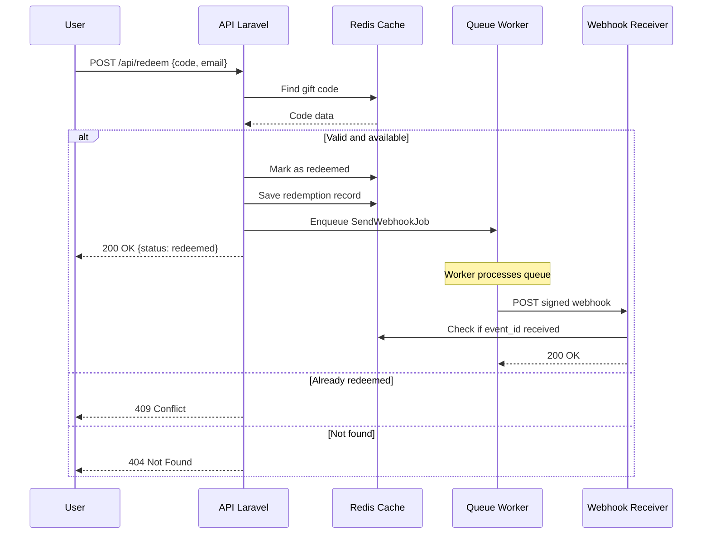

# GiftFlow Redeem API

Gift card redemption API with webhooks.

## Flow



## Local Setup

```bash
# Start containers
docker compose up --build -d

# Generate application key
docker compose exec redeem-api php artisan key:generate

# Seed initial data
docker compose exec redeem-api php artisan giftflow:seed
```

## Test

```bash
curl -X POST http://localhost:8000/api/redeem \
  -H "Content-Type: application/json" \
  -d '{"code":"GFLOW-TEST-0001","user":{"email":"test@example.com"}}'
```

## URLs

| Service | URL |
|---------|-----|
| API | http://localhost:8000 |
| Redis Commander | http://localhost:8081 |

## Real-time Logs

```bash
docker compose logs -f redeem-queue redeem-api
```

## Reset Data

```bash
docker compose exec redeem-api php artisan giftflow:seed --fresh
```
