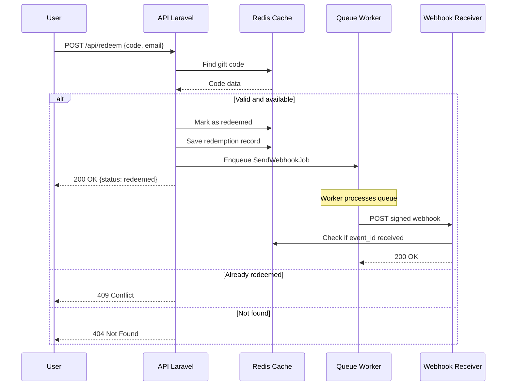

# GiftFlow Redeem API

Gift card redemption API with webhook notifications.

> Built with Laravel 11, PHP 8.2+, Redis, Docker, Pest

## Prerequisites

- Docker
- Docker Compose

## Flow



## API Reference

### `POST /api/redeem`

**Request:**
```json
{
  "code": "GFLOW-TEST-0001",
  "user": {
    "email": "user@example.com"
  }
}
```

**Success Response (200):**
```json
{
  "data": {
    "status": "redeemed",
    "code": "GFLOW-TEST-0001",
    "creator_id": "creator_123",
    "product_id": "product_abc",
    "webhook": {
      "status": "queued",
      "event_id": "evt_abc123..."
    }
  }
}
```

**Error Responses:**

| Status | Error | Description |
|--------|-------|-------------|
| 404 | `not_found` | Gift code does not exist |
| 409 | `already_redeemed` | Gift code was already redeemed |
| 422 | `validation_error` | Invalid request payload |

## Local Setup

```bash
# Copy environment file
cp .env.example .env

# Start containers
docker compose up --build -d

# Generate application key
docker compose exec redeem-api php artisan key:generate

# Seed initial data
docker compose exec redeem-api php artisan giftflow:seed

# Start queue worker (in a separate terminal)
docker compose exec redeem-api php artisan queue:work
```

## Running Tests

### Automated Tests (Pest)

```bash
docker compose exec redeem-api ./vendor/bin/pest
```

**Test coverage:** 38 tests, 104 assertions

The test suite uses integration tests that verify both API responses and persistence state (gray-box testing).

### Manual API Tests

Copy and paste the script below into your terminal:

```bash
echo "=========================================="
echo "  GiftFlow API - Manual Test Suite"
echo "=========================================="

echo -e "\n>>> Preparing environment..."
docker compose exec redeem-api php artisan cache:clear
docker compose exec redeem-api php artisan giftflow:seed --fresh

echo -e "\n=== TEST 1: Successful redemption (expects 200) ==="
curl -s -w "\nHTTP Status: %{http_code}\n" -X POST http://localhost:8000/api/redeem \
  -H "Content-Type: application/json" \
  -d '{"code":"GFLOW-TEST-0001","user":{"email":"userA@test.com"}}'

sleep 0.3

echo -e "\n=== TEST 2: Non-existent code (expects 404) ==="
curl -s -w "\nHTTP Status: %{http_code}\n" -X POST http://localhost:8000/api/redeem \
  -H "Content-Type: application/json" \
  -d '{"code":"INVALID-CODE-XXX","user":{"email":"test@test.com"}}'

echo -e "\n=== TEST 3: Already redeemed code (expects 409) ==="
curl -s -w "\nHTTP Status: %{http_code}\n" -X POST http://localhost:8000/api/redeem \
  -H "Content-Type: application/json" \
  -d '{"code":"GFLOW-USED-0003","user":{"email":"test@test.com"}}'

echo -e "\n=== TEST 4: Invalid request - missing email (expects 422) ==="
curl -s -w "\nHTTP Status: %{http_code}\n" -X POST http://localhost:8000/api/redeem \
  -H "Content-Type: application/json" \
  -H "Accept: application/json" \
  -d '{"code":"GFLOW-TEST-0002"}'

echo -e "\n=== TEST 5: Idempotency - same user, same code (expects 200) ==="
curl -s -w "\nHTTP Status: %{http_code}\n" -X POST http://localhost:8000/api/redeem \
  -H "Content-Type: application/json" \
  -d '{"code":"GFLOW-TEST-0001","user":{"email":"userA@test.com"}}'

echo -e "\n=== TEST 6: Different user tries already redeemed code (expects 409) ==="
curl -s -w "\nHTTP Status: %{http_code}\n" -X POST http://localhost:8000/api/redeem \
  -H "Content-Type: application/json" \
  -d '{"code":"GFLOW-TEST-0001","user":{"email":"userB@test.com"}}'

echo -e "\n=== TEST 7: Webhook with invalid signature (expects 401) ==="
curl -s -w "\nHTTP Status: %{http_code}\n" -X POST http://localhost:8000/api/webhook/issuer-platform \
  -H "Content-Type: application/json" \
  -H "X-GiftFlow-Signature: invalid-signature" \
  -d '{"event_id":"evt_test","type":"giftcard.redeemed","data":{"code":"TEST"}}'

echo -e "\n=========================================="
echo "  Test Suite Complete"
echo "=========================================="
```

#### Expected Results

| Test | Description | Expected |
|------|-------------|----------|
| 1 | Successful redemption | 200 |
| 2 | Non-existent code | 404 |
| 3 | Already redeemed (seeded) | 409 |
| 4 | Missing email | 422 |
| 5 | Idempotency (same user) | 200 |
| 6 | Different user, used code | 409 |
| 7 | Invalid webhook signature | 401 |

## Architecture Decisions

### Why Redis instead of file-based or in-memory?

The challenge suggested in-memory or file-based persistence, but I chose Redis:

| Approach | Shared State | Atomic Ops | Persistence | Race Conditions |
|----------|--------------|------------|-------------|-----------------|
| In-memory | ❌ Lost between containers | ❌ | ❌ | ⚠️ |
| File-based | ✅ Via volume | ❌ | ✅ | ⚠️ Possible |
| **Redis** | ✅ Native | ✅ O(1) Sets | ✅ | ✅ Protected |

Using Redis for both queue and persistence avoids additional dependencies while providing atomicity for concurrent requests.

### Double-Check Locking for Concurrency

Two concurrent requests could try to redeem the same code simultaneously. To prevent this:

1. **Idempotency check** (without lock): Check if the event_id was already processed to return the cached response immediately
2. **Acquire lock**: Use `Cache::lock("redeem:{code}")` to serialize access
3. **Re-validate inside lock**: Fetch fresh gift code and verify it's still available before processing

This pattern ensures only one request processes a redemption while maintaining good performance for repeated requests.

### Configuration via Environment Variables

All application settings are configurable via `.env`, following 12-factor app principles:

- Lock timeouts (`GIFTFLOW_LOCK_TIMEOUT`, `GIFTFLOW_LOCK_WAIT`)
- Webhook settings (`GIFTFLOW_WEBHOOK_SECRET`, `GIFTFLOW_WEBHOOK_URL`)

## URLs

| Service | URL |
|---------|-----|
| API | http://localhost:8000 |
| Swagger UI (API Docs) | http://localhost:8082 |
| Redis Commander | http://localhost:8081 |

## Real-time Logs

```bash
docker compose logs -f redeem-queue redeem-api
```

## Reset Data

```bash
docker compose exec redeem-api php artisan giftflow:seed --fresh
```
